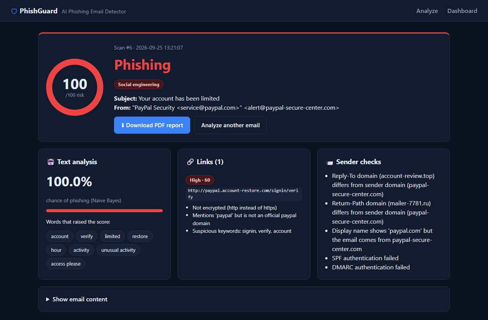
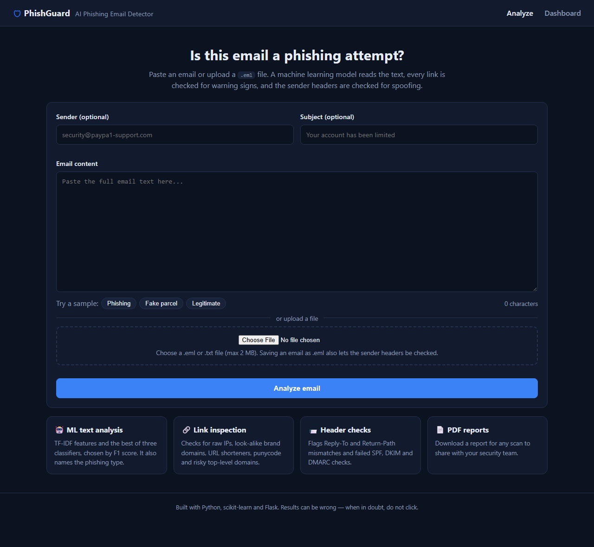
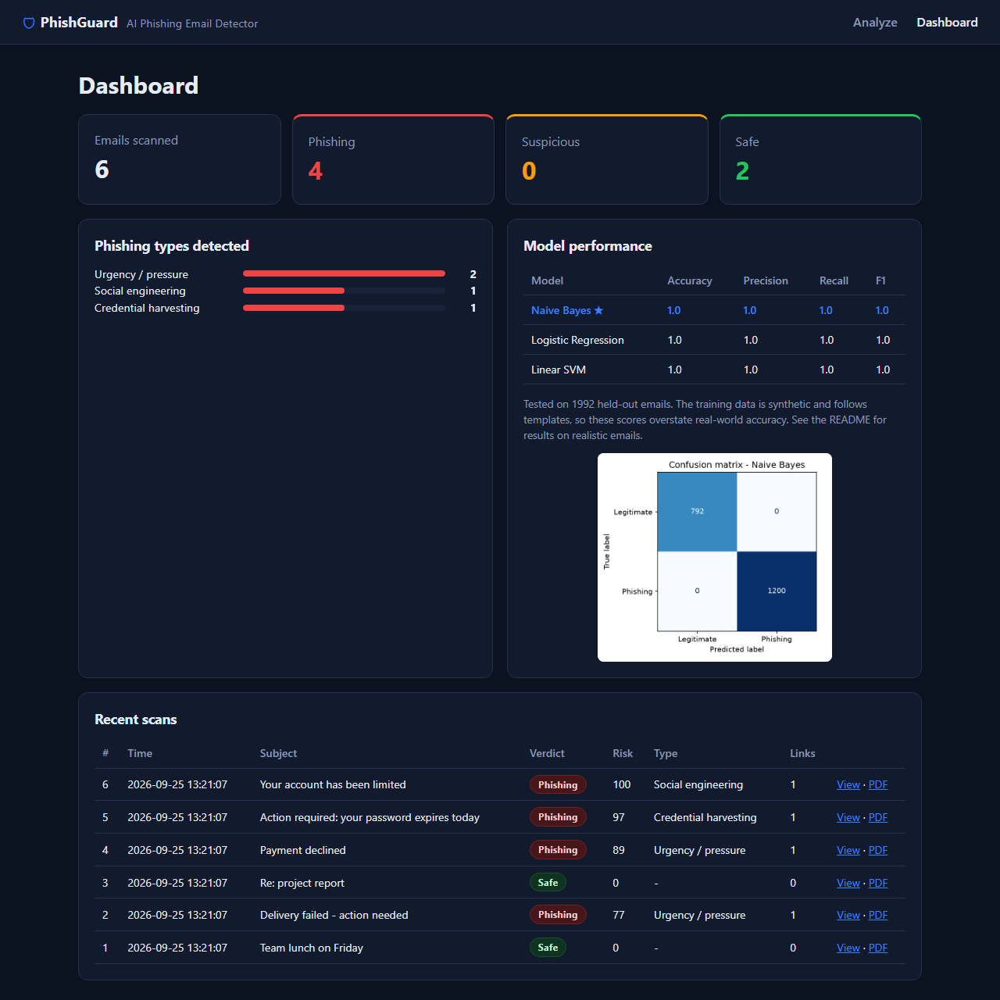
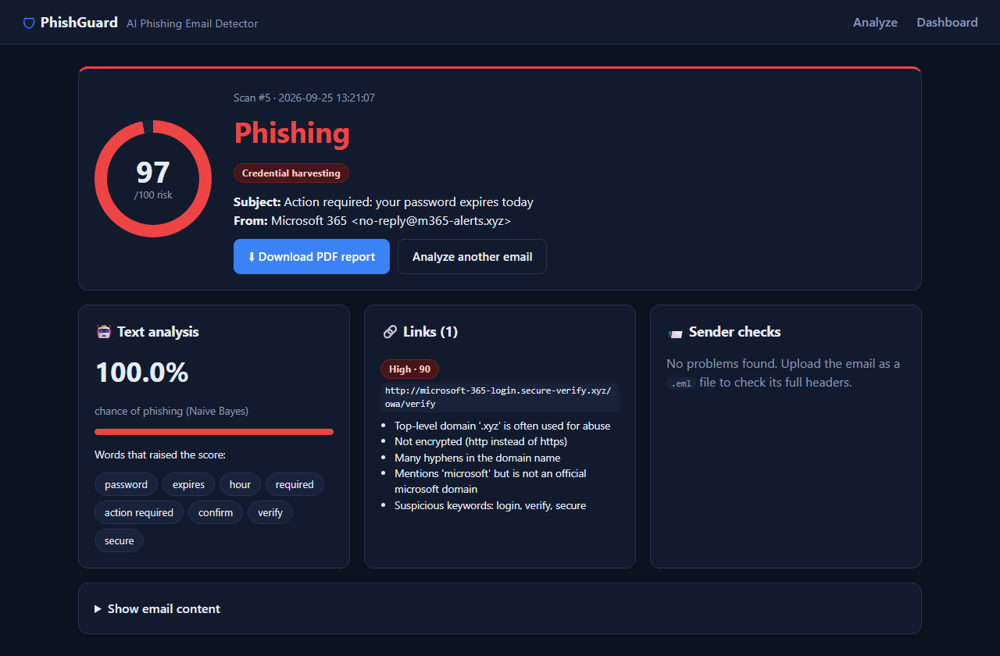
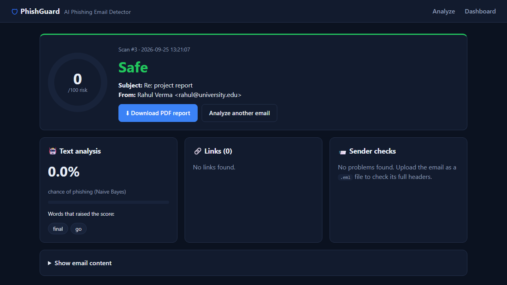

# PhishGuard: AI Phishing Email Detector

A Flask web app that decides whether an email is phishing. It combines three independent signals:

1. **A machine learning model** that reads the email text and also names the type of phishing
2. **A link inspector** that scores every URL for warning signs
3. **A sender check** that looks for spoofed headers and failed SPF, DKIM or DMARC authentication

Every scan is saved to a history dashboard and can be downloaded as a PDF report.




## Features

| Feature | How it works |
|---|---|
| **ML text classification** | Text is cleaned (lower-cased, stop words removed, lemmatized) and turned into TF-IDF features (words and word pairs). Naive Bayes, Logistic Regression and a Linear SVM are trained, and the one with the best F1 score is kept. |
| **Phishing type** | A second model sorts phishing into 10 types, such as credential harvesting, tech-support scam, authority impersonation or romance scam. |
| **Explainable results** | Shows which words in the email pushed the score towards phishing. |
| **Link inspection** | Flags raw IP addresses, look-alike brand domains (for example `paypal.account-restore.com`), URL shorteners, punycode, risky top-level domains, `@` tricks, unencrypted http, and more. |
| **Sender and header checks** | Upload a `.eml` file to check whether the Reply-To or Return-Path domain differs from the sender, whether the display name is spoofed, and whether SPF, DKIM or DMARC failed. |
| **Combined risk score** | Merges the three signals into one score from 0 to 100, with a verdict of **Safe**, **Suspicious** or **Phishing**. |
| **Trusted senders** | Mark a sender as trusted from any result. Trust is only applied when the email passes **DMARC**, because anyone can type any address into the From field. A dangerous link still overrides trust. |
| **Scan history dashboard** | Stored in SQLite: counts, phishing types seen, model metrics and recent scans. |
| **PDF reports** | Downloadable report for any scan ([example](docs/sample_report.pdf)). |
| **JSON API** | `POST /api/analyze` for connecting it to other tools. |

## How the risk score works

```
risk = 0.7 × (ML phishing probability × 100)
     + 0.3 × (score of the riskiest link)
     + 10 per sender problem (maximum 30)

A link scoring 50+ or two or more sender problems raises the risk to at least 40.
If only the text model finds a problem (no link scoring 20+, no sender problems),
the risk is capped at 59, so the verdict can be Suspicious but never Phishing.
A trusted sender that passes DMARC, with no risky link, is capped at 20 (Safe).

  0-34  Safe      35-59  Suspicious      60-100  Phishing
```

Keeping the signals separate means a well-written phishing email with a malicious link or a spoofed sender can still be caught, even if the text model is fooled. It also works the other way: the text model, the least reliable signal, can't label an email Phishing on its own.

## Screenshots

| Analyze page | Dashboard |
|---|---|
|  |  |

| Credential phishing | Legitimate email |
|---|---|
|  |  |

## Dataset

[Phishing and Legitimate Emails Dataset for ML 2026](https://www.kaggle.com/datasets/kuladeep19/phishing-and-legitimate-emails-dataset) by kuladeep19 on Kaggle: 10,000 emails (4,000 legitimate and 6,000 phishing across 10 types), each labelled with a phishing type and severity. The dataset is not included in this repository; download it from Kaggle.

## Model results and honest limitations

**On the held-out test set** (1,992 emails): all three models reach 100% accuracy, precision, recall and F1. The phishing-type model is also 100% accurate.

That number is **not realistic**. The dataset (10,000 emails) is synthetic: each email is built from a template and often ends with a `Keywords:` line. That makes held-out emails very easy to classify.

To get an honest estimate, [`evaluate_real_world.py`](evaluate_real_world.py) tests the full detector on 10 realistic emails that are not in the dataset:

| Result | Details |
|---|---|
| ✅ 4/5 phishing caught | Fake Microsoft 365 password expiry, fake parcel fee, PayPal "account limited", "unusual activity" |
| ❌ 1 phishing missed | An invoice fraud (business email compromise) email with no link and calm wording scored 44% |
| ✅ 2/5 legitimate emails passed | Team lunch invite, reply about a project report |
| ❌ 3 false alarms (marked Suspicious) | Genuine GitHub and Amazon notifications. They use the same words as phishing ("password changed", "view it", "your account") |

**Overall: 6 out of 10 correct.**

What this shows:
- **Dataset bias.** In the training data, friendly greetings such as "Hi there" appear only in phishing templates, so the model learned that a greeting is suspicious.
- **Invoice fraud is hard to detect from text alone.** It usually has no link and no urgent language, so the link inspector and sender checks matter as much as the model.
- **Link and header checks catch attacks the text model misses.** The spoofed PayPal sample triggers five separate sender warnings.

**A real false positive from testing:** a long personal email from a friend (about 1,200 words after cleaning, while the longest training email has 46) was labelled Phishing at 98% by the text model. Splitting it into training-sized chunks didn't help: 84% of the chunks still scored as phishing. That showed the real problem was the narrow range of "legitimate" emails in the training data, not the length. The design changes that came from this:
1. The text model alone can only reach **Suspicious**.
2. Results warn when an email is far longer than anything in the training data.
3. **Trusted senders**, verified with DMARC, so a known contact isn't flagged again but a forged copy of their address still is.

## Getting started

```bash
git clone https://github.com/dewikbavishi-alt/AI-Phishing-Email-Detector.git
cd AI-Phishing-Email-Detector
python -m venv venv
venv\Scripts\activate
pip install -r requirements.txt
python app.py
```

Open http://127.0.0.1:5000. On macOS or Linux, activate the environment with `source venv/bin/activate`.

The trained model (`model/detector.pkl`) is included, so the app runs straight away. To retrain it, download the dataset (see [Dataset](#dataset)), save it as `dataset/phishing email.csv`, and run `python train_model.py`.

**Try it:**
- Click one of the **sample** buttons on the home page.
- Upload [`samples/spoofed_paypal.eml`](samples/spoofed_paypal.eml) to see the header checks.
- Run `python evaluate_real_world.py` to reproduce the realistic-email test.

**API example:**

```bash
curl -X POST http://127.0.0.1:5000/api/analyze -H "Content-Type: application/json" -d "{\"subject\": \"Account limited\", \"body\": \"Log in to restore access: http://paypal.account-restore.com/signin\"}"
```

## Project structure

```
├── app.py                    # Flask routes (web pages, PDF report, JSON API)
├── train_model.py            # Trains and compares the models, saves metrics and confusion matrix
├── evaluate_real_world.py    # Tests the detector on realistic emails
├── utils/
│   ├── preprocessing.py      # Text cleaning (NLTK)
│   ├── analyzer.py           # Combines ML, URL and header checks into a verdict
│   ├── url_checker.py        # URL risk rules
│   ├── database.py           # SQLite scan history
│   └── report_generator.py   # PDF reports (ReportLab)
├── templates/                # Jinja2 pages
├── static/                   # CSS, JavaScript, confusion matrix image
├── samples/                  # Example .eml files
├── model/                    # Trained model and metrics
├── dataset/                  # Kaggle CSV goes here (not included)
└── docs/                     # Screenshots and a sample report
```

## Security notes

- Uploaded files are read in memory and never saved to disk. Uploads are limited to 2 MB and to `.eml` and `.txt` files.
- Email content is always escaped when shown, so HTML or scripts inside an email can't run in the browser.
- Links in analyzed emails are never visited. All URL checks are offline string analysis.
- Only the **topmost** `Authentication-Results` header is used. It is added by your own mail server, while lower copies could be inserted by the sender to fake a DMARC pass.
- Trusted senders are only honoured when DMARC passes, so spoofing a trusted address doesn't work.
- Debug mode is off unless `FLASK_DEBUG=1` is set.

## Future work

- Retrain on real email data, such as the Enron corpus for legitimate mail and public phishing collections, to fix the dataset bias.
- Try transformer models (DistilBERT) and compare them against TF-IDF.
- Check domains against live threat feeds (PhishTank, Google Safe Browsing) and domain registration age (WHOIS).
- Build a browser or Outlook add-in so emails can be scanned from the inbox.

## Tech stack

Python · Flask · scikit-learn · NLTK · pandas · SQLite · ReportLab · BeautifulSoup · Matplotlib · HTML/CSS/JavaScript

## License

MIT
